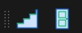
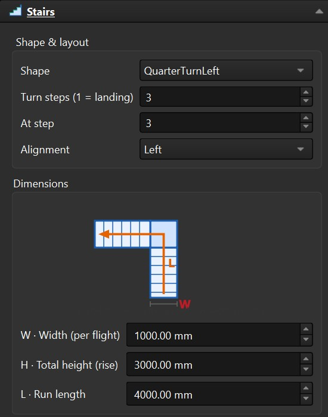
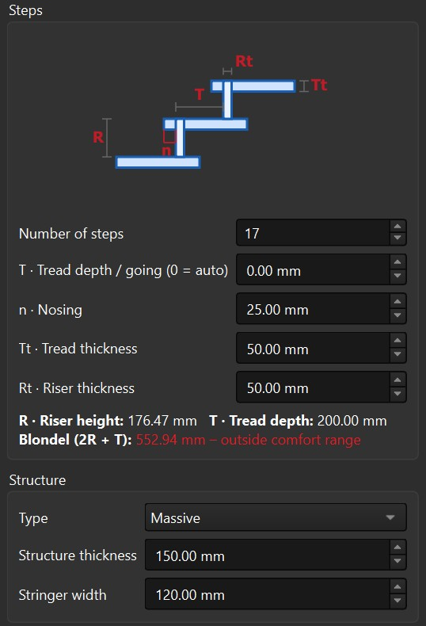
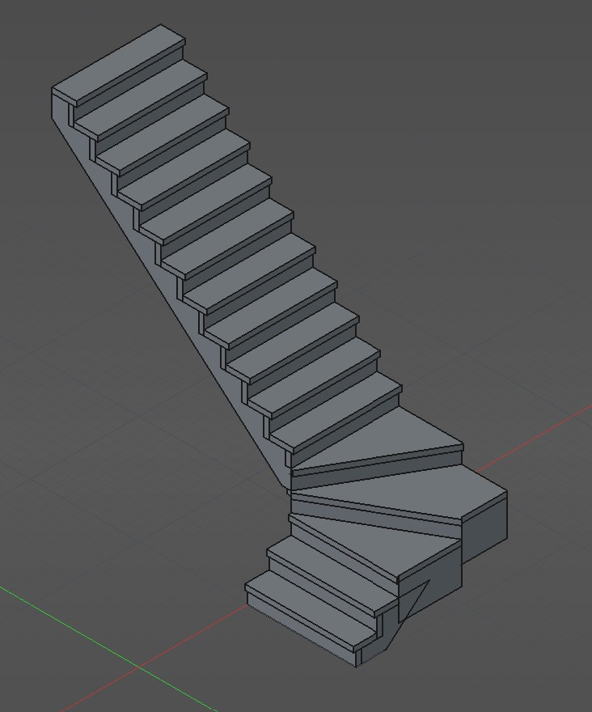
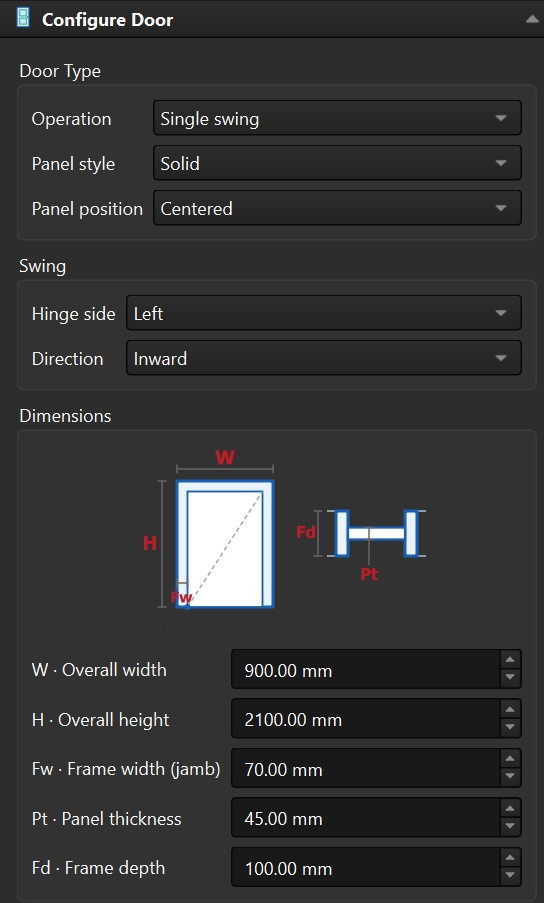
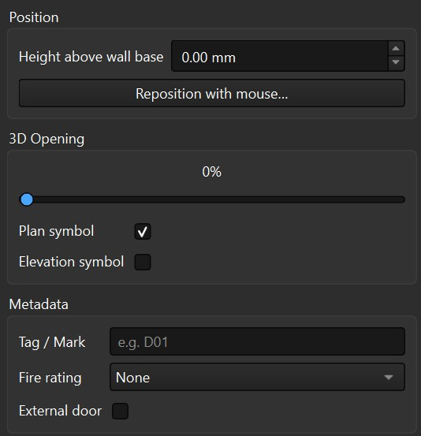
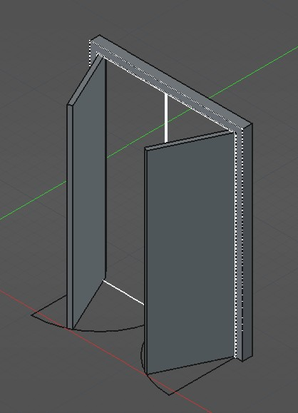

# ArchPlus

A FreeCAD add-on that extends the built-in **BIM** workbench with enhanced
Arch tools. It adds an **ArchPlus** toolbar and menu inside the BIM workbench.

It currently provides enhanced parametric **Stairs** and **Doors** tools. Each
geometry engine is a modifiable copy of a native FreeCAD module — `ArchStairs`
for stairs and `ArchWindow` for doors — so every native feature (IFC export,
hosting/opening cuts, presets, …) is preserved while new behaviour is added on
top, without affecting the built-in tools.

## Features (Stairs)

- **Configuration dialog** (Task panel) with **live preview** — the stair
  renders in the 3D view as you change values, and updates as you edit.
- **Double-click to edit** an existing stairs object, reusing the panel.
- **Comfort note** — live riser/tread readout and Blondel ratio (2R + T) check.
- **Configurable landing position** — `LandingStep` places the landing/turn on
  any step (0 = auto, centered) instead of always at the middle.
- **Half- and quarter-turn winders** — a turn is built from winder (wedge)
  steps that sweep 180° (half) or 90° (quarter) while climbing, filling a
  square footprint. Set the turn to a single step for a flat landing instead.

| Configuration dialog | Comfort note & options |
| --- | --- |
|  |  |

## Features (Doors)

- **Configuration dialog** (Task panel) with **live preview** — the door
  renders as you edit, and the host wall's opening re-cuts immediately.
- **Double-click** (or right-click → **Edit**) to reopen the panel on an
  existing door.
- **Operations** — Single/Double swing, Single/Double sliding, and
  Opening-only (a bare hole, no leaf).
- **Panel styles** — Solid or full Glass.
- **Swing controls** — hinge side and opening direction for hinged doors.
- **Opening animation** — a 0–100 % slider: swing leaves rotate about the
  hinge, sliding leaves slide aside.
- **Panel position** — place the leaf Centered (default), flush Front, or flush
  Back within the frame depth.
- **Opening symbols** — plan (swing arc) and elevation symbols, each
  toggleable (elevation off by default).
- **Mouse placement** — click a wall face and the door drops to the wall base
  (floor) automatically and centres on the cursor, so you only aim *along* the
  wall. A sill/threshold offset is available during placement.
- **Reposition with the mouse** — from the panel button or right-click →
  **Reposition**: pick a new spot; the door re-orients to the wall face you
  point at, re-snaps to the floor, and re-cuts the host wall.

| Configuration dialog | Opening & panel options |
| --- | --- |
|  |  |

## Installation

Clone (or copy) this repository into your FreeCAD user `Mod` folder:

- **Linux:** `~/.local/share/FreeCAD/Mod/ArchPlus` (or, for FreeCAD 1.1,
  `~/.config/FreeCAD/...`)
- **Windows (FreeCAD 1.1):**
  `%APPDATA%\FreeCAD\v1-1\Mod\ArchPlus`

The exact path is `FreeCAD.getUserAppDataDir()` + `Mod` (run it in FreeCAD's
Python console). Restart FreeCAD, switch to the **BIM** workbench, and use the
**ArchPlus** toolbar.

## Usage

BIM workbench → **ArchPlus** toolbar:

- **Stairs** → configure → **OK**. Double-click a stairs object to edit it.
- **Doors** → click a wall face to place → configure in the panel. Double-click
  (or right-click → Edit) a door to reopen the panel; right-click →
  **Reposition** to move it with the mouse.

## TODO

Stairs:
- [ ] Support railings, balusters, etc.
- [ ] For half-turns, support spacing between the two stairways.

Windows:
- [ ] Better positioning
- [ ] Better UI

## Requirements

- FreeCAD 1.1 (the BIM/Arch modules must be available).

## License

LGPL-2.1-or-later. This add-on includes modified copies of FreeCAD's
`ArchStairs.py` and `ArchWindow.py` (© Yorik van Havre), so as a derivative
work it is licensed under the same terms. See [LICENSE](LICENSE).
