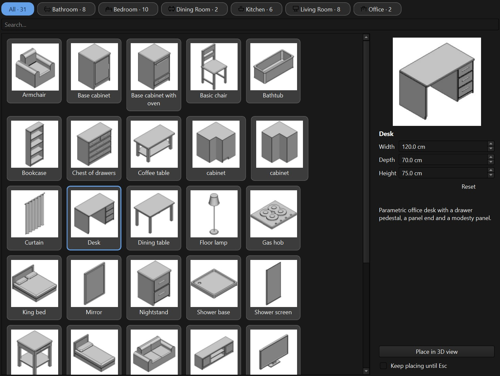

# ArchPlus

A FreeCAD add-on that extends the built-in **BIM** workbench with enhanced
Arch tools. It adds an **ArchPlus** toolbar and menu inside the BIM workbench.

It currently provides enhanced parametric **Stairs**, **Doors**, and **Windows**
tools, plus a **Parts Library** for inserting catalog furnishings.

## What's inside

| | |
|---|---|
|  | **Stairs** — live-preview configuration, configurable landings, and half-/quarter-turn winders. [Guide](docs/TOOLS.md#stairs) |
|  | **Doors** — swing, sliding and opening-only doors hosted in walls, with a live-preview panel and mouse placement. [Guide](docs/TOOLS.md#doors) |
|  | **Windows** — rectangular and round windows, casement and sliding, hosted in walls at sill height. [Guide](docs/TOOLS.md#windows) |
|  | **Parts Library** — a one-screen catalog browser for parametric furniture, extensible with plain JSON manifests (no code) or Python builders. [Guide](docs/PARTS-LIBRARY.md) |

## Installation

Clone (or copy) this repository into your FreeCAD user `Mod` folder:

- **Linux:** `~/.local/share/FreeCAD/Mod/ArchPlus` (or, for FreeCAD 1.1,
  `~/.config/FreeCAD/...`)
- **Windows (FreeCAD 1.1):**
  `%APPDATA%\FreeCAD\v1-1\Mod\ArchPlus`

The exact path is `FreeCAD.getUserAppDataDir()` + `Mod` (run it in FreeCAD's
Python console). Restart FreeCAD, switch to the **BIM** workbench, and use the
**ArchPlus** toolbar.

## Quick start

BIM workbench → **ArchPlus** toolbar:

- **Stairs** → configure → **OK**. Double-click a stairs object to edit it.
- **Doors** → click a wall face to place → configure in the panel. Double-click
  (or right-click → Edit) a door to reopen the panel; right-click →
  **Reposition (pick point)** to move it with the mouse.
- **Windows** → click a wall face to place (drops to a 900 mm sill height by
  default) → configure in the panel. Double-click (or right-click → Edit) a
  window to reopen the panel; right-click → **Reposition (pick point)** to
  move it with the mouse.
- **Parts Library** → filter by room chip and/or search the catalog in the
  library tab, edit its parameters, then click **Place** and click a floor
  or wall face to insert it. Right-click a placed part → **Reload from
  library** to refresh it from its manifest.

## Documentation

- [Tools guide](docs/TOOLS.md) — stairs, doors and windows in detail.
- [Parts Library](docs/PARTS-LIBRARY.md) — browser features and the part
  authoring guide (manifests, model files, builders, IFC metadata).
- [Testing](docs/TESTING.md) — how the headless test suite works.
- [Roadmap](docs/ROADMAP.md) — planned work.

## Requirements

- FreeCAD 1.1 (the BIM/Arch modules must be available).

## License

LGPL-2.1-or-later. This add-on includes modified copies of FreeCAD's
`ArchStairs.py` and `ArchWindow.py` (© Yorik van Havre), so as a derivative
work it is licensed under the same terms. `ArchWindow.py` is shared by both the
Doors and Windows tools (each keeps its own copy). See [LICENSE](LICENSE).
