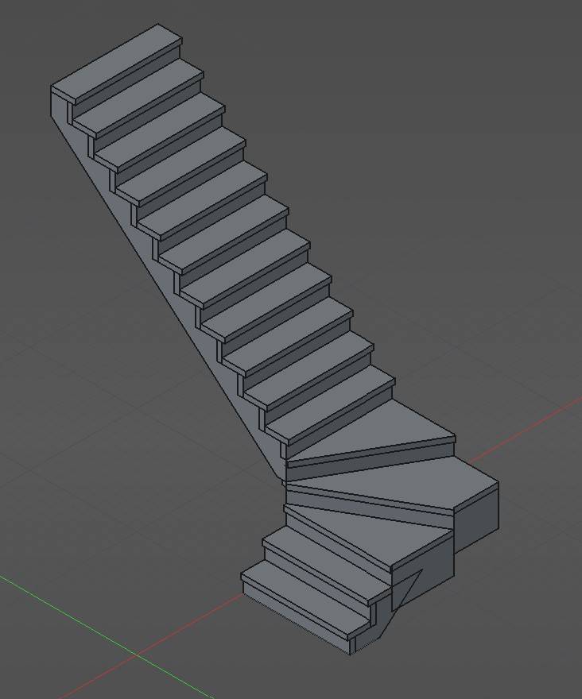
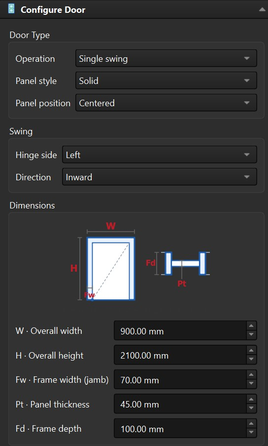
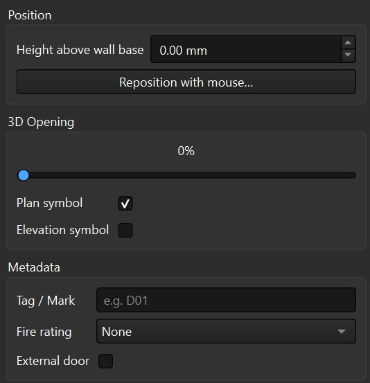
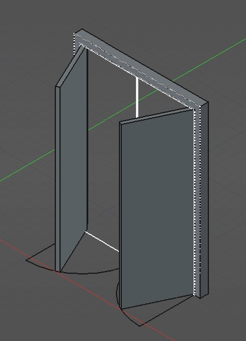

# ArchPlus

A FreeCAD add-on that extends the built-in **BIM** workbench with enhanced
Arch tools. It adds an **ArchPlus** toolbar and menu inside the BIM workbench.

It currently provides enhanced parametric **Stairs**, **Doors**, and **Windows**
tools, plus a **Parts Library** for inserting catalog furnishings. Each
geometry engine for Stairs, Doors and Windows is a modifiable copy of a native
FreeCAD module — `ArchStairs` for stairs and `ArchWindow` for doors and
windows — so every native feature (IFC export, hosting/opening cuts, presets,
…) is preserved while new behaviour is added on top, without affecting the
built-in tools. The Parts Library is different in kind: it is a content
library and browser rather than a modified copy of a native Arch module,
inserting single lightweight objects built from bundled part definitions.

## Features (Stairs)

- **Configuration dialog** (Task panel) with **live preview** — the stair
  renders in the 3D view as you change values, and updates as you edit.
- **Double-click to edit** an existing stairs object, reusing the panel.
- **Comfort note** — live riser/tread readout and Blondel ratio (2R + T) check.
- **Configurable landing position** — `LandingStep` places the landing/turn on
  any step (0 = auto, centered) instead of always at the middle.
- **Half- and quarter-turn winders** — a turn is built from winder (wedge)
  steps that sweep 180° (half) or 90° (quarter) while climbing, filling a
  square footprint. Set the turn to a single step for a flat landing instead.

| Configuration dialog | Comfort note & options |
| --- | --- |
|  |  |

## Features (Doors)

- **Configuration dialog** (Task panel) with **live preview** — the door
  renders as you edit, and the host wall's opening re-cuts immediately.
- **Double-click** (or right-click → **Edit**) to reopen the panel on an
  existing door.
- **Operations** — Single/Double swing, Single/Double sliding, and
  Opening-only (a bare hole, no leaf).
- **Panel styles** — Solid or full Glass.
- **Swing controls** — hinge side and opening direction for hinged doors.
- **Opening animation** — a 0–100 % slider: swing leaves rotate about the
  hinge, sliding leaves slide aside.
- **Panel position** — place the leaf Centered (default), flush Front, or flush
  Back within the frame depth.
- **Height above wall base** — lift the door off the floor for a threshold or
  mid-wall placement (0 = sitting on the floor).
- **Opening symbols** — plan (swing arc) and elevation symbols, each
  toggleable (elevation off by default).
- **Mouse placement** — click a wall face and the door drops to the wall base
  (floor) automatically and centres on the cursor, so you only aim *along* the
  wall. A sill/threshold offset is available during placement.
- **Reposition with the mouse** — from the panel button or right-click →
  **Reposition**: pick a new spot; the door re-orients to the wall face you
  point at, re-snaps to the floor, and re-cuts the host wall.

| Configuration dialog | Opening & panel options |
| --- | --- |
|  |  |

## Features (Windows)

- **Configuration dialog** (Task panel) with **live preview** — the window
  renders as you edit, and the host wall's opening re-cuts immediately.
- **Double-click** (or right-click → **Edit**) to reopen the panel on an
  existing window.
- **Shapes** — Rectangular or **Round** (a circular oculus). A round window is
  fixed glass; its diameter follows the width.
- **Operations** — Fixed (no opening), Single casement, Single sliding, and
  Double casement (rectangular only).
- **Swing controls** — hinge side and opening direction for casement windows.
- **Opening animation** — a 0–100 % slider: casement sashes rotate about the
  hinge, sliding sashes slide aside.
- **Sash position** — set the sash flush to the Front/interior (default) or
  Back/exterior face within the frame depth (only matters when the sash is
  shallower than the frame).
- **Full 4-sided frame** — unlike doors (which sit on the floor and use a
  3-sided frame), windows get a frame on all four sides including the bottom
  sill jamb, since they sit in a wall opening.
- **Single undivided glass pane** per sash.
- **Opening symbols** — plan (swing arc) and elevation symbols, each
  toggleable (elevation off by default).
- **Mouse placement** — click a wall face and the window drops to a sill height
  (default 900 mm) above the wall base automatically and centres on the cursor,
  so you only aim *along* the wall. The sill height is adjustable during
  placement.
- **Reposition with the mouse** — from the panel button or right-click →
  **Reposition**: pick a new spot; the window re-orients to the wall face you
  point at, re-sets to the sill height, and re-cuts the host wall.
- **Flip without reopening** — right-click a casement window → **Invert Opening
  Direction** or **Invert Hinge Position** to mirror the swing in place.

## Features (Parts Library)

ArchPlus ships a starter catalogue of 31 parametric parts across Kitchen,
Dining Room, Bedroom, Living Room, Bath Room and Office,
alongside the faceted vocabulary (`library/facets.json`) and the
browser/placement machinery. Parts are floor-, wall- or free-hosted, so
wall cabinets, mirrors and curtains position against a wall the way a
door does.
Add further part folders under `library/` (each with its own `part.json`
manifest, validated against that vocabulary) to extend it; an empty result
set (e.g. after a search with no matches) shows a plain "nothing here yet"
message instead of a blank void.

- **Dockable browser** — click **Parts Library** to open a dock ("ArchPlus
  Library") that stays open across placements, so you can insert several
  parts in a row without reopening anything.
- **Faceted grouping** — group the catalog by `Function`, `Element` or
  `Room` via a **Group by** combo; the chosen facet persists across FreeCAD
  restarts.
- **Multi-valued facets** — a part can belong to several rooms at once (a WC
  under both Bathroom and Bedroom, for example) and appears under each
  group it declares.
- **Search** — a live search box filters the grid by name, keyword and
  description as you type.
- **Live preview with derived measurements** — selecting a part shows a 3D
  preview and a `W × D × H` readout measured from the built shape, never
  authored by hand, so the stated size can never disagree with the geometry.
- **Variants** — parts can declare named variants (e.g. cabinet widths);
  switching **Variant** in the detail pane or the property editor rebuilds
  the shape and measurements in place.
- **Host-aware click-to-place** — click **Place**, then click a floor or
  wall face: the part drops to the correct height for its declared host
  (e.g. a wall-hung WC lands at the wall base plus its mounting height) and
  orients to the face.
- **Single-object insertion, no tree pollution** — placing a part adds
  exactly one object with no children, and deleting it leaves the tree
  completely clean.
- **Reload from library** — right-click a placed part and choose **Reload
  from library** to re-read its manifest and rebuild it; opening or
  recomputing a document never silently rebuilds a part from a
  since-edited definition on its own.

## Installation

Clone (or copy) this repository into your FreeCAD user `Mod` folder:

- **Linux:** `~/.local/share/FreeCAD/Mod/ArchPlus` (or, for FreeCAD 1.1,
  `~/.config/FreeCAD/...`)
- **Windows (FreeCAD 1.1):**
  `%APPDATA%\FreeCAD\v1-1\Mod\ArchPlus`

The exact path is `FreeCAD.getUserAppDataDir()` + `Mod` (run it in FreeCAD's
Python console). Restart FreeCAD, switch to the **BIM** workbench, and use the
**ArchPlus** toolbar.

## Usage

BIM workbench → **ArchPlus** toolbar:

- **Stairs** → configure → **OK**. Double-click a stairs object to edit it.
- **Doors** → click a wall face to place → configure in the panel. Double-click
  (or right-click → Edit) a door to reopen the panel; right-click →
  **Reposition** to move it with the mouse.
- **Windows** → click a wall face to place (drops to a 900 mm sill height by
  default) → configure in the panel. Double-click (or right-click → Edit) a
  window to reopen the panel; right-click → **Reposition** to move it with the
  mouse.
- **Parts Library** → browse/group/search the catalog in the dock, select a
  part and variant, then click **Place** and click a floor or wall face to
  insert it. Right-click a placed part → **Reload from library** to refresh
  it from its manifest.

## TODO

Stairs:
- [ ] Support railings, balusters, etc.
- [ ] For half-turns, support spacing between the two stairways.

Windows:
- [ ] Muntins/grille (divided lite grids, e.g. 2×2, 3×3)
- [ ] Awning/hopper (top/bottom-hung) and tilt-and-turn operations
- [ ] Triple-pane and double-casement-plus-fixed configurations
- [ ] Real projecting sill geometry (currently the bottom jamb is flush)

## Requirements

- FreeCAD 1.1 (the BIM/Arch modules must be available).

## License

LGPL-2.1-or-later. This add-on includes modified copies of FreeCAD's
`ArchStairs.py` and `ArchWindow.py` (© Yorik van Havre), so as a derivative
work it is licensed under the same terms. `ArchWindow.py` is shared by both the
Doors and Windows tools (each keeps its own copy). See [LICENSE](LICENSE).
