# ArchPlus tools

User guide for the enhanced **Stairs**, **Doors** and **Windows** tools. For
the Parts Library see [PARTS-LIBRARY.md](PARTS-LIBRARY.md); for the road ahead
see [ROADMAP.md](ROADMAP.md).

Each geometry engine is a modifiable copy of a native FreeCAD module —
`ArchStairs` for stairs and `ArchWindow` for doors and windows — so every
native feature (IFC export, hosting/opening cuts, presets, …) is preserved
while new behaviour is added on top, without affecting the built-in tools.

## Stairs

- **Configuration dialog** (Task panel) with **live preview** — the stair
  renders in the 3D view as you change values, and updates as you edit.
- **Double-click to edit** an existing stairs object, reusing the panel.
- **Comfort note** — live riser/tread readout and Blondel ratio (2R + T) check.
- **Configurable landing position** — `LandingStep` places the landing/turn on
  any step that leaves at least one step on each flight (0 = auto, centered)
  instead of always at the middle.
- **Half- and quarter-turn winders** — a turn is built from winder (wedge)
  steps that sweep 180° (half) or 90° (quarter) while climbing, filling a
  square footprint. Set the turn to a single step for a flat landing instead.

### Layouts

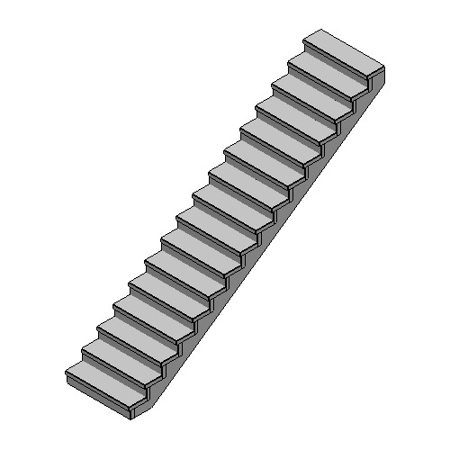
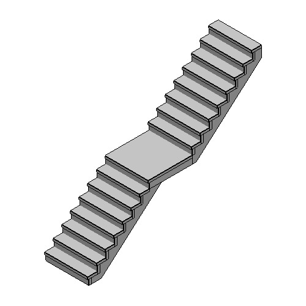
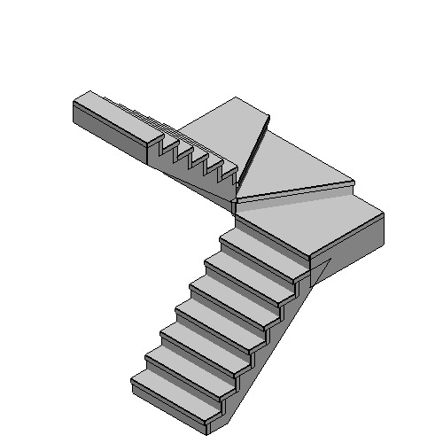
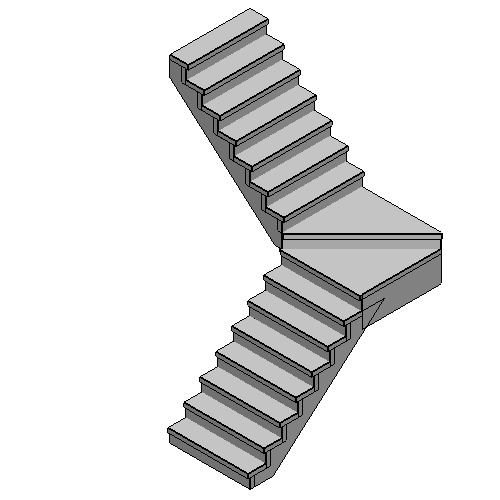

### Configuration dialog

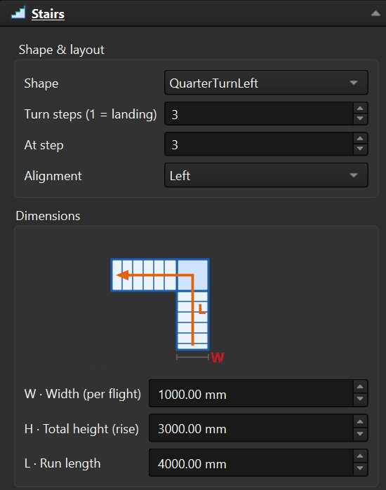
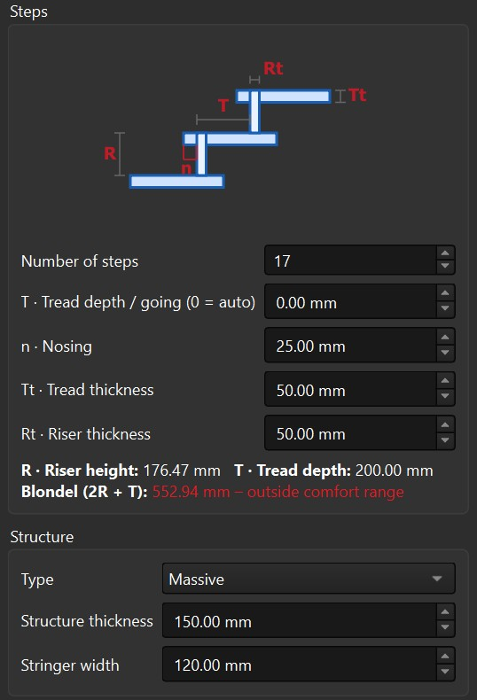

### Usage

BIM workbench → **ArchPlus** toolbar → **Stairs** → configure → **OK**.
Double-click a stairs object to edit it.

## Doors

- **Configuration dialog** (Task panel) with **live preview** — the door
  renders as you edit, and the host wall's opening re-cuts immediately.
- **Double-click** (or right-click → **Edit**) to reopen the panel on an
  existing door.
- **Operations** — Single swing, Double swing, Sliding (single), Sliding
  (double), and Opening only (a bare hole, no leaf).
- **Panel styles** — Solid or Glass (full).
- **Swing controls** — hinge side and opening direction for hinged doors.
- **Opening animation** — a 0–100 % slider: swing leaves rotate about the
  hinge, sliding leaves slide aside.
- **Panel position** — place the leaf Centered (default), flush Front, or flush
  Back within the frame depth.
- **Height above wall base** — lift the door off the floor for a threshold or
  mid-wall placement (0 = sitting on the floor).
- **Opening symbols** — plan (swing arc) and elevation symbols, each
  toggleable (elevation off by default).
- **Mouse placement** — click a wall face and the door drops to the wall base
  (floor) automatically and centres on the cursor, so you only aim *along* the
  wall. A sill/threshold offset is available during placement.
- **Reposition with the mouse** — from the panel button or right-click →
  **Reposition (pick point)**: pick a new spot; the door re-orients to the
  wall face you point at, re-snaps to the floor, and re-cuts the host wall.

### Layouts

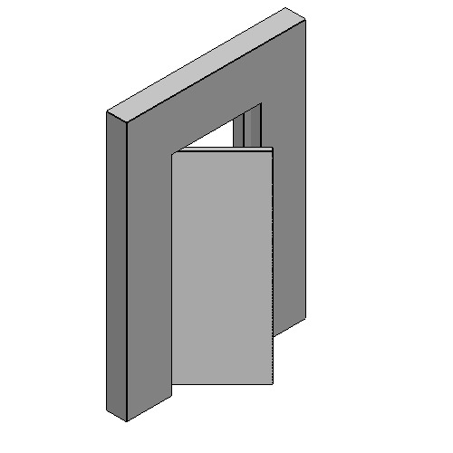
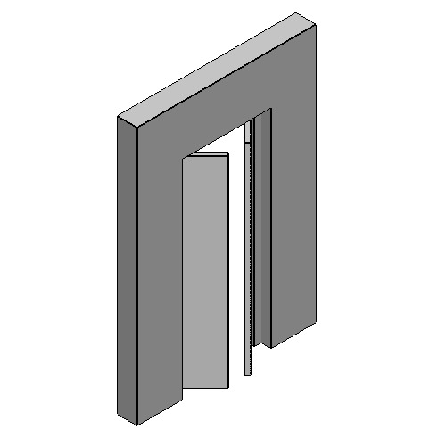

### Configuration dialog


### Usage

BIM workbench → **ArchPlus** toolbar → **Doors** → click a wall face to place →
configure in the panel. Double-click (or right-click → **Edit**) a door to
reopen the panel; right-click → **Reposition (pick point)** to move it with
the mouse.

## Windows

- **Configuration dialog** (Task panel) with **live preview** — the window
  renders as you edit, and the host wall's opening re-cuts immediately.
- **Double-click** (or right-click → **Edit**) to reopen the panel on an
  existing window.
- **Shapes** — Rectangular or **Round** (a circular oculus). A round window is
  fixed glass; its diameter follows the width.
- **Operations** — Fixed (no opening), Single casement, Single sliding, and
  Double casement (rectangular only).
- **Swing controls** — hinge side and opening direction for casement windows.
- **Opening animation** — a 0–100 % slider: casement sashes rotate about the
  hinge, sliding sashes slide aside.
- **Sash position** (casement only) — set the sash flush to the Front/interior
  (default) or Back/exterior face within the frame depth (only matters when
  the sash is shallower than the frame). For sliding windows the fixed half
  is always at the front and the sliding half at the back.
- **Full 4-sided frame** — unlike doors (which sit on the floor and use a
  3-sided frame), windows get a frame on all four sides including the bottom
  sill jamb, since they sit in a wall opening.
- **Single undivided glass pane** per sash.
- **Opening symbols** — plan (swing arc) and elevation symbols, each
  toggleable (elevation off by default).
- **Mouse placement** — click a wall face and the window drops to a sill height
  (default 900 mm) above the wall base automatically and centres on the cursor,
  so you only aim *along* the wall. The sill height is adjustable during
  placement.
- **Reposition with the mouse** — from the panel button or right-click →
  **Reposition (pick point)**: pick a new spot; the window re-orients to the
  wall face you point at, snaps to the wall base (the sill height is not
  preserved — set it again in the panel), and re-cuts the host wall.
- **Flip without reopening** — right-click a casement window → **Invert Opening
  Direction** to mirror the swing in place.

### Layouts

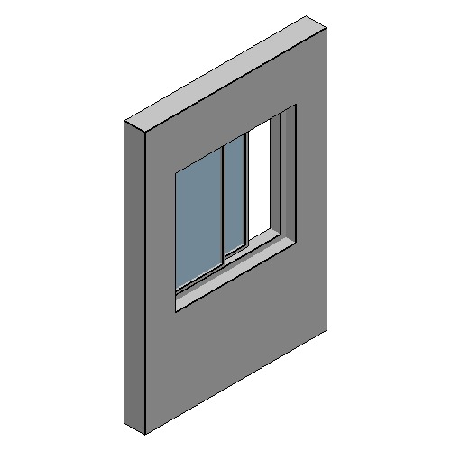
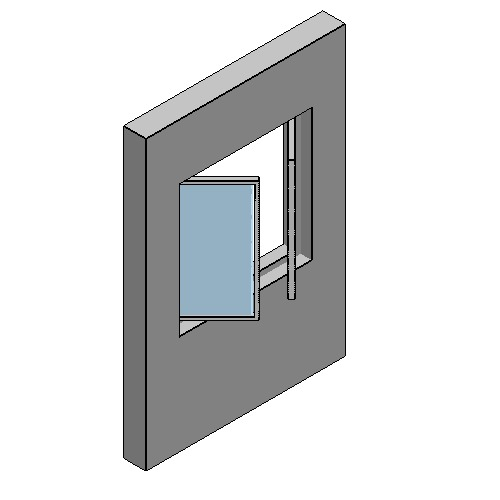
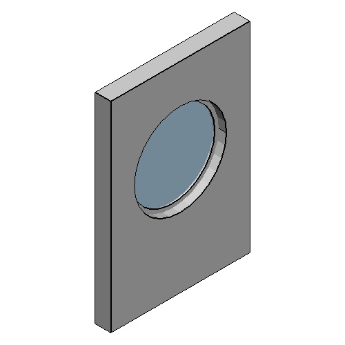

### Usage

BIM workbench → **ArchPlus** toolbar → **Windows** → click a wall face to place
(drops to a 900 mm sill height by default) → configure in the panel.
Double-click (or right-click → **Edit**) a window to reopen the panel;
right-click → **Reposition (pick point)** to move it with the mouse.

## Regenerating the images

The layout images above are generated, not hand-captured: `docs/gen_images.py`
builds each layout, hosts it in a real Arch Wall, and renders it offscreen with
the Parts Library's thumbnail renderer. Run it from the repository root:

```
"C:\Program Files\FreeCAD 1.1\bin\freecad.exe" docs/gen_images.py
```

It needs a GUI session (the offscreen renderer wants a GL context),
overwrites the generated layout images in `docs/images/` (the dialog
screenshots are hand-captured and untouched), and the layouts to render live
in the `DOORS`, `WINDOWS` and `STAIRS` lists at the top of the script.

## Walk Through

First-person mode for inspecting a model at eye height — mouse-driven.
Click **Walk Through**, then aim the small figure in the 3D view and
left-click: the camera starts there at the person height (1.65 m by
default) along the picked face's normal (a floor puts you on it, a wall
puts you in front of it). Placement runs on the Draft Snapper's real
mouse pipeline, so the stand point is the actual surface under the
cursor — a click on a 2nd-floor slab starts you there, and clicking bare
ground stands you on the z=0 plane. While walking:

- **Mouse wheel** — step forward/back along the view heading (one notch
  ≈ 30 cm; a fast scroll piles up notches, capped per step)
- **Hold Right-mouse + move** — look around
- **Esc**, **click the tool again**, or the panel's **Exit** — stop and
  restore the camera

The camera follows the ground: floors and stairs raise/lower your eyes
within a 0.6 m rise / 2 m drop tolerance; over gaps or big drops the
height is held. Clicking a storey whose slab doesn't exist under the
click keeps that level until you walk onto real geometry near it (e.g.
stairs). The task panel adjusts person height (meters, or ft/in when
your unit scheme is imperial), look-axis inversion, and the walk camera's
field of view (90°/67° horizontal) while you walk. Movement is
view-only — nothing in the document changes, and the camera/projection
you had before is restored on exit.
